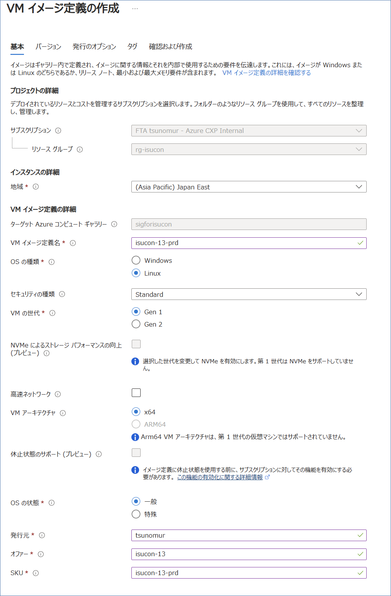
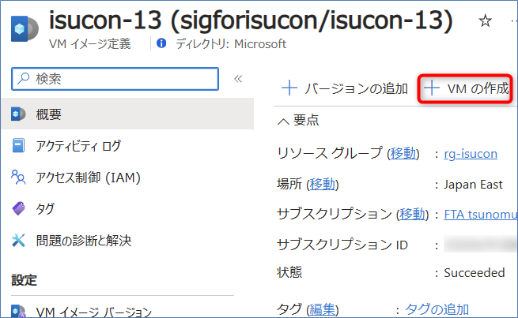

# isucon13

## はじめに

このディレクトリ以下の構成やファイルは以下のリポジトリを参考にさせて頂き作成しました。  
`privision.sh` に関してはそのまま利用させて頂いています。  
https://github.com/matsuu/aws-isucon/tree/main/isucon13

## Build

### 1. Azure Compute Gallery の作成

Azure Compute Gallery を作成し、VM image definition(VM イメージ定義) も作成してください。その際、バージョン等は指定する必要はありません。

作成例:


### 2. Packer の実行

#### 2.1. サービスプリンシパルの作成

```sh
az ad sp create-for-rbac -o json --name example-isucon > principal.json
```

#### 2.2. 設定ファイルの作成

`variables.auto.pkrvars.hcl.sample` を参考にして変数を変更してください。

特に、Azure Compute Gallery の部分は以下を参考にしてください。
```
gallery_name = "sigforisucon"       # Azure Compute Gallery の名前
image_name = "isucon-13"            # VM image definition の名前
image_version = "0.0.1"             # 作成したいバージョン
replication_regions = ["japaneast"] # レプリケーション先のリージョン
resource_group = "rg-isucon"        # Azure Compute Gallery のリソースグループ
```
`vm_size` を変えて VM のスペックを上げるとビルドが早くなります。


#### 2.3. ビルド

```
packer build .
```

2コア 4GB の VM で 1 時間程度かかります。

## Deploy

ビルドしたイメージから VM を作成します。



## Others

そのほかの注意点、手順はこちらの README を参照してください。  
https://github.com/matsuu/aws-isucon/tree/main/isucon13
