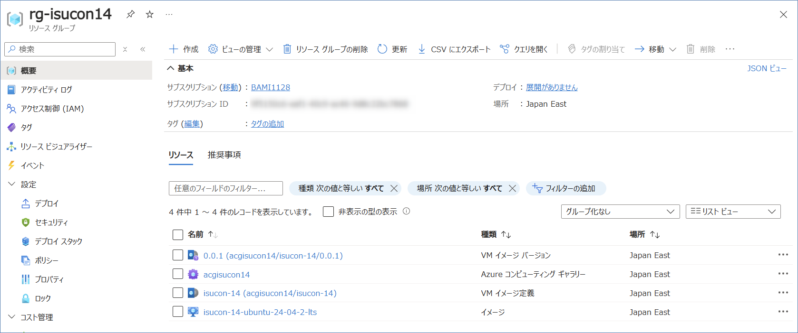
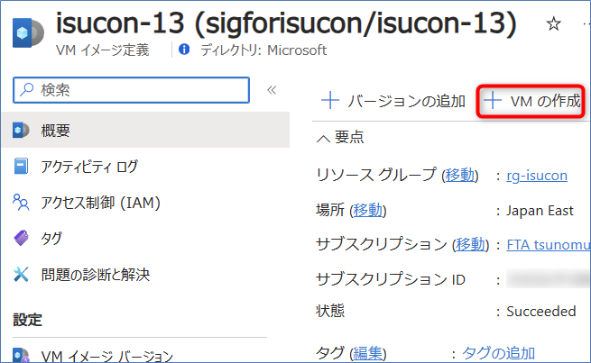

# isucon14

## はじめに

このディレクトリ以下の構成やファイルは以下のリポジトリを参考にさせて頂き作成しました。  
`privision.sh` に関してはそのまま利用させて頂いています。  
https://github.com/matsuu/aws-isucon/tree/main/isucon14

## Build

### 1. Azure Compute Gallery の作成

Azure Compute Gallery を作成し、VM image definition(VM イメージ定義) も作成してください。その際、バージョン等は指定する必要はありません。

```sh
# 1. Compute Galleryの作成
az sig create --resource-group rg-isucon14 --gallery-name acgisucon14 --location japaneast --description "My Compute Gallery"
# 2. イメージ定義の作成
az sig image-definition create \
  --resource-group rg-isucon14 \
  --gallery-name acgisucon14 \
  --gallery-image-definition isucon-14 \
  --publisher isucon14 \
  --offer isucon14 \
  --sku isucon14 \
  --os-type Linux \
  --os-state Generalized \
  --hyper-v-generation V2 \
  --location japaneast
```

### 2. Packer の実行

#### 2.1. サービスプリンシパルの作成

```sh
az ad sp create-for-rbac -o json --name example-isucon > principal.json
```

#### 2.2. 権限の割り当て

サービスプリンシパルの作成後、共同作成者としてサブスクリプションに割り当てます。

> [!CAUTION]
> 最小特権を考えるとサブスクリプション全体に共同作成者の権限を割り当てることはお勧めされないので必要に応じて適切な権限を設定してください。

#### 2.3. 設定ファイルの作成

`variables.auto.pkrvars.hcl.sample` を参考にして変数を変更してください。

特に、Azure Compute Gallery の部分は以下を参考にしてください。

```hcl
gallery_name = "acgisucon14"        # Azure Compute Gallery の名前
image_name = "isucon-14"            # VM image definition の名前
image_version = "0.0.1"             # 作成したいバージョン
replication_regions = ["japaneast"] # レプリケーション先のリージョン
resource_group = "rg-isucon14"      # Azure Compute Gallery のリソースグループ
```

`vm_size` を変えて VM のスペックを上げるとビルドが早くなります。

#### 2.3. ビルド

```sh
packer build .
```

2コア 4GB の VM で 1 時間程度かかります。

ビルド後:


## Deploy

ビルドしたイメージから VM を作成します。



## Others

そのほかの注意点、手順はこちらの README を参照してください。  
https://github.com/matsuu/aws-isucon/tree/main/isucon13
